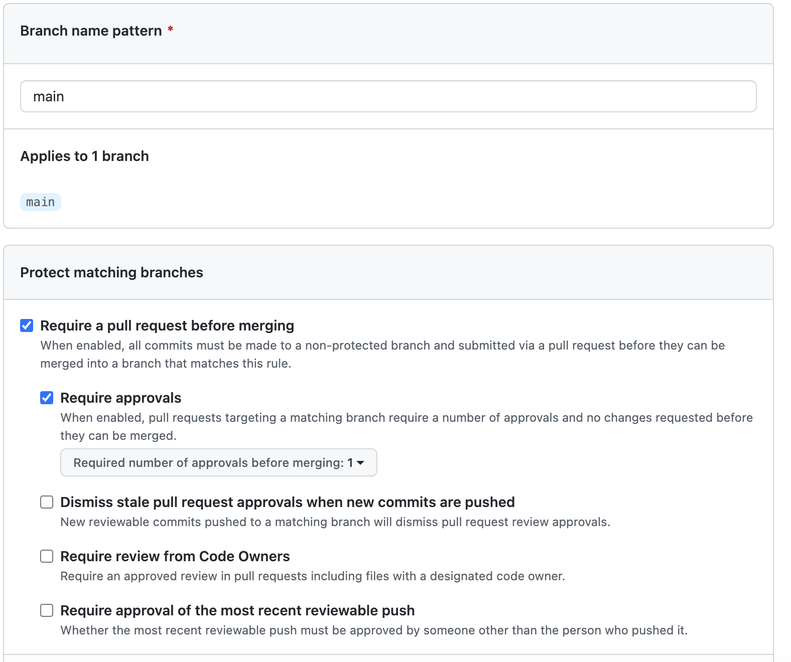
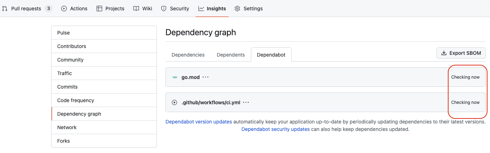

# Auto Merge Dependabot Pull Requests

I assume `main` branch is a protection branch, and setting branch protection rules.

## Branch protection rule
1. In your repository navigation to Settings > Branches
1. Under “Branch protection rules” select `Add branch protection rule`
1. Branch name pattern -> main
1. Enable the following settings
    1. Require a pull request before merging
    1. Require approvals

See the following picture:

## GITHUB_TOKEN permissions
1. In your repository navigation to Settings > Actions > General
1. Under “Workflow permissions” enable the following settings
    1. Read and write permissions
    1. Allow Github Actions to create and approve pull requests

See the following picture:

