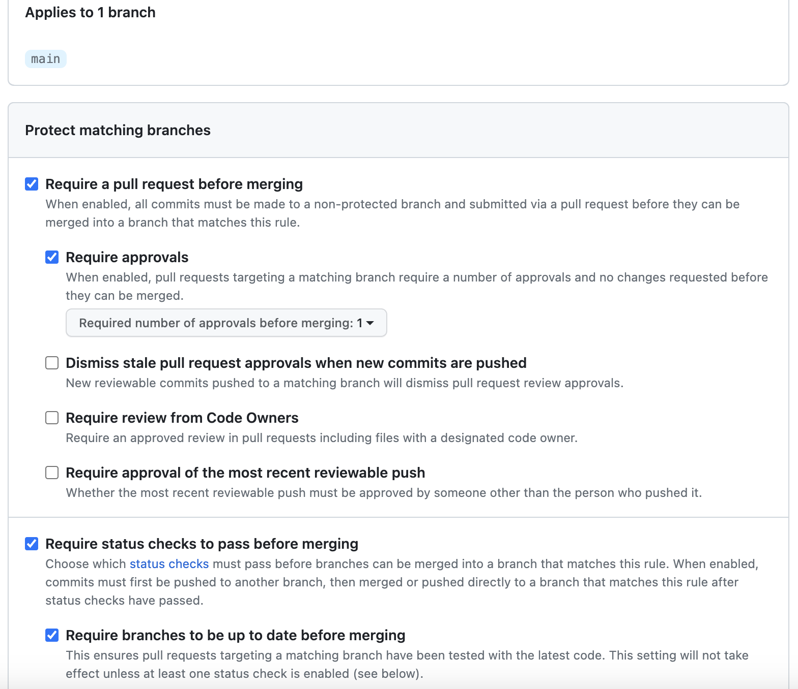

# Auto Merge Dependabot Pull Requests

I am assuming `main` branch is a protection branch, and setting branch protection rules.

## Branch protection rule
1. In your repository navigation to Settings > Branches
1. Under “Branch protection rules” select `Add branch protection rule`
1. Branch name pattern -> main
1. Enable the following settings
    1. Require a pull request before merging
    1. Require approvals
    1. Require status checks to pass before merging -> Prevent merging pull requests with failing build
    1. Require branches to be up to date before merging

See the following picture:

## Configure Dependabot version updates
We enable Dependabot to a repository by creating a directory called `.github` in the root directory and adding a file named `dependabot.yml` inside.

Once we push `dependabot.yml` to Github, Dependabot will start the first scan of our repo and create the first pull requests to update dependencies, unless all the dependencies are already at their latest version.

Dependabot will also create their own branches and merge into the `default` branch such as main or dev.

## Store credentials for Dependabot to use
To give Dependabot access to the private registries supported by GitHub, you store the registry’s access token or secret in the secret store for your repository or organization.

+ In your repository navigation to Settings > Secrets and variables > **Dependabot** > New repository secret

## GITHUB_TOKEN permissions
1. In your repository navigation to Settings > Actions > General
1. Under “Workflow permissions” enable the following settings
    1. Read and write permissions
    1. Allow Github Actions to create and approve pull requests

See the following picture:

